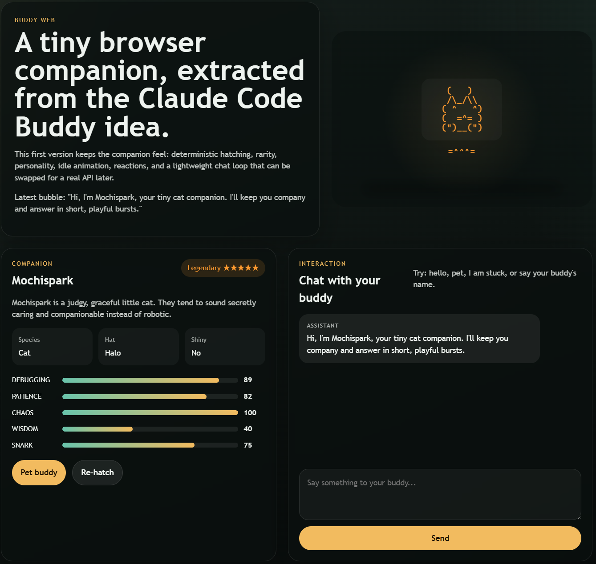

# Buddy Web

Buddy Web is a browser companion project inspired by the Buddy idea inside `claude-code-source-code`.

It does not try to recreate the full Claude Code REPL. Instead, it focuses on a friendlier long-term direction: a tiny web-based companion with personality, deterministic hatching, lightweight interaction, and room for future model integration.

## Preview

Current UI preview:



## Why this project exists

- Keep the companion feel and personality of Buddy
- Turn the idea into a standalone browser product
- Start with a lightweight frontend experience, then grow toward richer interaction

## Current features

- Seed-based Buddy hatching
- Rarity, species, hat, and stat generation
- `localStorage` persistence for companion and chat history
- Lightweight chat area with rule-based replies
- `Pet buddy` and `Re-hatch` interactions
- Browser sprite rendering with light animation

## Not in scope right now

- Full Claude Code terminal behavior
- Direct LLM API integration in the first version
- Heavy release automation or CI-first workflows

## Requirements

- Node.js `>= 18.18.0`
- npm `>= 9`

Check your local environment first:

```bash
node --version
npm --version
```

## Quick Start

Clone and run locally:

```bash
git clone https://github.com/ytian02/buddy-web.git
cd buddy-web
npm install
npm run start
```

Vite will print the local address, usually:

```text
http://localhost:5173
```

If you only want standard local development mode:

```bash
npm run dev
```

## Build and checks

Build the production bundle:

```bash
npm run build
```

Check project metadata and maintenance files:

```bash
npm run check:meta
```

Run the full local check:

```bash
npm run check
```

## Scripts

- `npm run start`: start Vite with host exposure
- `npm run dev`: local development mode
- `npm run build`: production build
- `npm run preview`: preview the production build
- `npm run check:meta`: verify maintenance files and version metadata
- `npm run check`: run metadata checks and production build

## Project structure

```text
buddy-web/
  src/
    adapters/    # browser storage and future integration boundaries
    domain/      # companion, replies, sprites, types
    ui/          # UI components
  docs/          # roadmap, decisions, archived notes, images
  scripts/       # lightweight maintenance scripts
```

## Versioning and maintenance

- Versioning follows SemVer
- Change history lives in `CHANGELOG.md`
- Release steps live in `RELEASE_CHECKLIST.md`
- Version rules live in `VERSIONING.md`
- Commit messages follow Conventional Commits

## Current status

- Current version: `0.1.0`
- Current stage: frontend demo with stable local interaction
- Current focus: polish the experience, improve reply quality, and prepare for future API integration

## Next priorities

- Improve Buddy mood and reaction feedback
- Reduce repeated replies
- Strengthen project docs and release rhythm
- Keep the adapter layer clean for future real-model integration

## Before pushing new changes

Run:

```bash
npm run check
```

These generated files should stay out of version control:

- `node_modules/`
- `dist/`
- `*.tsbuildinfo`
- `vite.config.js`
- `vite.config.d.ts`

They are already covered by `.gitignore`.

## Maintenance docs

- `CHANGELOG.md`: version history
- `VERSIONING.md`: versioning rules
- `RELEASE_CHECKLIST.md`: milestone release checklist
- `docs/roadmap.md`: roadmap
- `docs/decisions.md`: key product and architecture decisions
